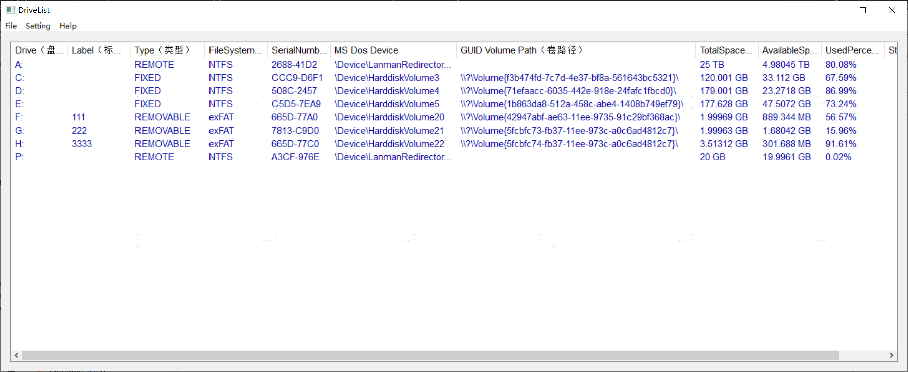

# LogicalDriveList
a tiny windows applicaton, list all logical drive, and monitor logical drive

### Features:
- List All Logical Drive and Other Info
- Monitor Logical Change and Reload 
- Copy The Logical Drive Info To Clipboard

### W.I.P
- Lock and Unlock Volume 
- Reject Volume

### Snap 
